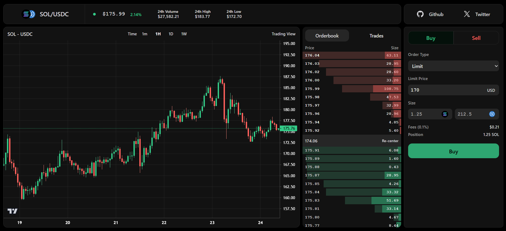
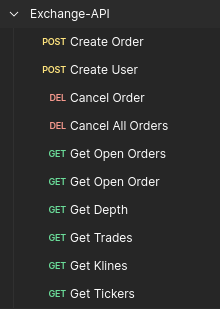

<h1 align="center">Exchange ⚡</h1>

<p align="center">
    🚀 A high-performance centralized cryptocurrency exchange built in Rust.
    <br /> <br />
    <a href="#introduction"><strong>Introduction</strong></a> ·
    <a href="#features"><strong>Features</strong></a> ·
    <a href="#tech-stack"><strong>Tech Stack</strong></a> ·
    <a href="#architecture"><strong>Architecture</strong></a> ·
    <a href="#order-matching--execution"><strong>Order Matching & Execution</strong></a> ·
    <a href="#contributing"><strong>Contributing</strong></a> ·
    <a href="#local-development"><strong>Local Development</strong></a> ·
    <a href="#license"><strong>License</strong></a>
</p>
<p align="center">
  <a href="https://x.com/jogeshwar01">
    
  </a>

</p>

## Introduction

Exchange is a low-latency centralized cryptocurrency exchange designed for high-frequency trading (HFT). Built in Rust, it features an in-memory order book, real-time WebSocket updates, and an optimized backend powered by Redis and Postgres for maximum efficiency.

## Architecture


## User Interface

- Github Repository - [Exchange-Web](https://github.com/jogeshwar01/exchange-web)
- Design Reference - [Drift Labs](https://app.drift.trade/)



## Features

- ⚡ **Ultra-fast Order Matching** – Sub-10ms order execution.
- 🏦 **In-memory Order Book & Balances** – Ensures low latency and high throughput.
- 🔥 **Real-time WebSockets** – Live updates for market depth, trades, and tickers.
- 📈 **Advanced Matching Engine** – Optimized price-time priority order matching.
- 🔄 **Fault-tolerant Architecture** – Redis-backed pub/sub and persistent Postgres storage.
- 🔌 **Efficient API Layer** – REST & WebSocket APIs for seamless integration.

## Tech Stack

- [Rust](https://www.rust-lang.org/) – Core language for speed and memory safety.
- [Redis](https://redis.io/) – High-speed pub/sub and caching layer.
- [Postgres](https://www.postgresql.org/) – Persistent storage for trade history and user balances.
- [Tokio](https://tokio.rs/) – Asynchronous runtime for high-performance networking.
- [Actix](https://actix.rs/) – Web framework for API handling.
- [Tokio-Tungstenite - WebSockets](https://github.com/snapview/tokio-tungstenite) – Real-time data streaming.
- [Serde](https://serde.rs/) – Serialization/deserialization of structured data.
- [SQLx](https://github.com/launchbadge/sqlx) – Database interaction with async support.
- [Fred (Pub/Sub)](https://github.com/aembke/fred.rs) – Efficient Redis client for messaging.

### Components

1. **Primary Rust Backend**

   - Handles REST API and WebSocket requests.
   - Routes requests to Order Management, User Balances, and Market Data services.
   - Publishes responses via Redis.

2. **Redis**

   - Acts as a message queue for real-time order processing.
   - Temporarily stores market data (active orders, tickers).
   - Manages pub/sub for market data updates.

3. **Postgres**

   - Persistent storage for trade history, balances, and order data.
   - Updated asynchronously to avoid performance bottlenecks.

4. **WebSocket Layer**

   - Streams market depth, ticker data, and trade executions.
   - Pushes updates in real time to connected clients.

5. **Matching Engine**
   - Maintains in-memory order books.
   - Executes trades using price-time priority.
   - Manages the order lifecycle (creation, execution, cancellation).

## API Endpoints



### Order Management

- `POST /api/v1/order` → Create/Execute a new order
- `GET /api/v1/order` → Get details of an order
- `DELETE /api/v1/order` → Cancel an active order
- `GET /api/v1/orders` → Get open orders for a user
- `DELETE /api/v1/orders` → Cancel all orders for a user

### Market Data

- `GET /api/v1/klines` → Get kline (candlestick) data
- `GET /api/v1/depth` → Get order book depth
- `GET /api/v1/trades` → Get recent trades
- `GET /api/v1/tickers` → Get market tickers

### User Management

- `POST /api/v1/users` → Create a new user
- `POST /api/v1/user/deposit` → Deposit funds (pending)
- `POST /api/v1/user/withdraw` → Withdraw funds (pending)

## Order Matching & Execution

#### **Data Structures**

```rust
struct Engine {
  orderbooks: Vec<Orderbook>,
  balances: BTreeMap<String, UserBalances>,
}

struct Orderbook {
    bids: BTreeMap<Decimal, Vec<Order>>,
    asks: BTreeMap<Decimal, Vec<Order>>,
    asset_pair: AssetPair,
    last_update_id: i64,
}

struct Order {
    order_id: String,
    user_id: String,
    symbol: String,        // e.g., SOL_USDC
    side: String,          // Buy/Sell
    order_type: String,    // Limit/Market
    order_status: String,
    quantity: Decimal,
    filled_quantity: Decimal,
    price: Decimal,
    timestamp: i64,
}

struct Amount {
  available: Decimal,
  locked: Decimal,
}

struct UserBalances {
  user_id: String,
  balance: HashMap<Asset, Amount>,
}
```

#### Order Execution Flow

- Orders are processed asynchronously using Rust’s `tokio`.
- The engine pops new orders from Redis and checks the order book.
- If a match is found, trade execution happens.
- Trades and balances are published via Redis for WebSocket updates.
- Final orderbook state is stored in Postgres.

## Contributing

We love our contributors! Here's how you can contribute:

- [Open an issue](https://github.com/jogeshwar01/exchange/issues) if you believe you've encountered a bug.
- Follow the [local development setup guide](#local-development) below to get your local dev environment set up.
- Make a [pull request](https://github.com/jogeshwar01/exchange/pull) to add new features/make quality-of-life improvements/fix bugs.

## Local Development

```sh
git clone https://github.com/jogeshwar01/exchange.git
cd rust-exchange
cargo build
cp .env.example .env   // Configure Postgres and Redis credentials in .env.
docker-compose up -d
cargo run
```

## License

The exchange is open-source under the MIT License. You can [find it here](https://github.com/jogeshwar01/exchange/blob/main/LICENSE.md).
